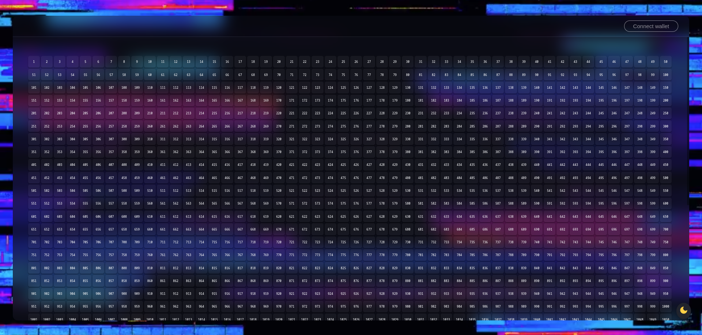

# KAROSHI DEGENS

#### For the true degenerates of you! | [https://degens.karoshi.studio/](https://degens.karoshi.studio/)

### THE SOCIAL EXPERIMENT

Raffles in crypto are a pretty big thing and surely fun. We're taking them to the next level!

When game begins, every KAROSHI holder who is staking and opts in for the game spot will receive a bonus share of $ROSHI tokens and whitelist spots the free mint of the **KAROSHI DEGENS**. These will be WL spots for blocks \[2-6]. The number of WL spots received will be proportional to the number of NFT's staked. The WL spots for blocks 0 and 1 will be locked until the second phase begins.

> The above image is a 50x35 fractionalized NFT composed of 1750 items that form to 22 real pieces of artwork combined into one. It will be revealed gradually when all pieces from a block are brought together.

### **Ready for a fucked up plan?**

* Every one of the 1750 items has an ID.
* Some of the ID's are in the same block.
* Every one of the 22 blocks has a map of ID's that it contains.
* Your goal is to collect one full block.
* Biggest blocks will get the biggest rewards.

Game Dynamics:

### _Phase 1 begins here_

After the free mint, you will now have x amount of random NFT's.\
From here you can either collect, sell to the secondary market or raffle. If you lose in the first phase, you'll have one more chance to get in the second phase.

To decentivize selfish behavior and holding them and incentivize all participants to play the long game, the royalties will be 69.66% and will go to the game pool. We might also increase/decrease them as we go to discourage holding and most probably, during the last round, they will incrementally go to 100%.

Connecting your wallet you will be able to see your collection in dashboard.\
Once reached the deadline, 22 players with the most of the block collected will enter phase three. They are now _Team 1._

The rest of the players will participate in raffles in which winner takes all. After raffles are completed, _Team 2_ is formed from winners and they enter stage two.

If you did not make it through this stage, this is the last chance for you.

Snapshots will be taken daily, 22 of the most active addresses will be awarded 50% of the WL spots for next two blocks and they join _Team 2_. The next 50% WL will go to the first team.\
The whitelist for blocks 0 and 1 is completed, and they are unlocked and minted. Now your next goal is to collect blocks 0-1.

***

### _The second phase begins._

In this phase, the 44 players compete for their block until 22 players remain.\
When only 22 players are in the stage two, they enter stage 3.

### _The third stage begins_

You can participate in raffles to win more or just wait.\
When deadline is met, each player from Team 1 is randomly matched with one from team 2. The one with the most NFT's takes all. Gradually the 22 pieces are revealed over the course of the last 12 raffles

***

At the end of the game, the 22 winners get distributed 70% of the royalties from phase 1 based on their block size. They get delivered real version of the NFT block. They also are allowed to free claim an integral NFT of their block.\
The real delivered piece will have an NFC chip embedded that guarantees its authenticity. The other 30% will be used for $ROSHI buybacks and providing liquidity.

Royalties from phase 2 will be split 50/50 between a charity and a public airdrop to all who participated in the game.

_**People who decide to get their game rewards in $ROSHI will benefit of a 15% increase in their rewards.**_

***

**And HODL your $ROSHI tokens, you'll need them for the second game!**

#### Rules:

Cooperate!

#### Disclaimer

> The spots in the game will be awarded just to holders that are willing to play it until the end and claim their spot by opting in. We are aware that due to the decentralized nature of things, some of the NFT's could get lost, others just held too much, or some players may not want to sell them. This is why if things don't go as planned, the game could end even if some players won't have 100% of the block, and as we say, this is a social experiment. Let market dynamics do the thing, we count on you!

If you have an idea, we will be happy to hear!

#### &#x20;
