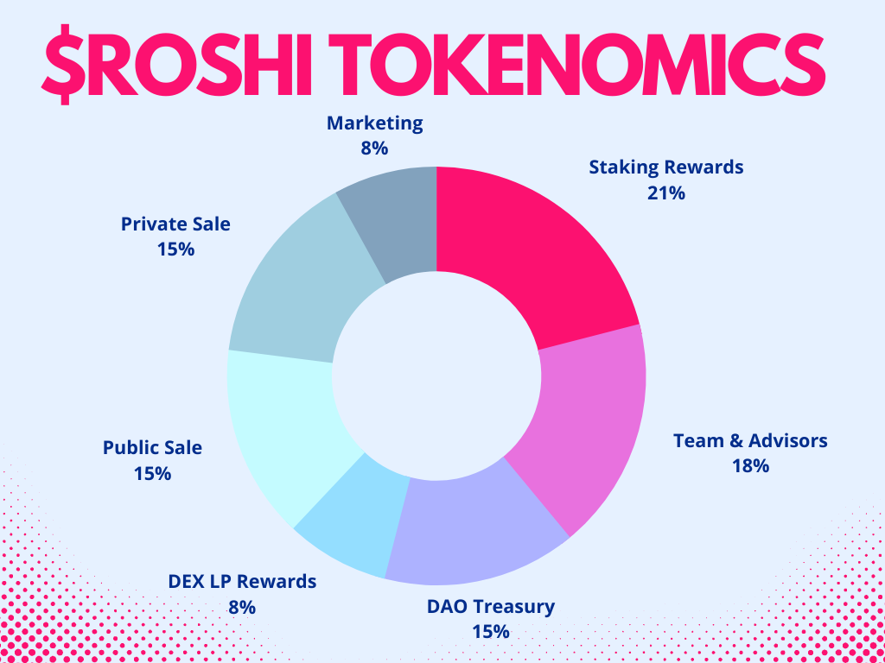

# Lightpaper

### Introduction

KAROSHI is the genesis collection, consisting of 10000 Ninjas and Samurais with over 200 individual traits. We are a Web 3.0 brand with a team that is passionate about what we are doing and we are here to make a social impact by building the right things, creating synergy between technology and people and raising awareness about modern problems.&#x20;

We learned a lot from successful, as well as from failed projects. We know you did too. We learned from our mistakes. We got out of the comfort zone and we learned to work in a team. We learned to think outside the box and manage our time. We learned to be creative, we also learned what patience means. We know where to be persistent and where to be flexible. Now is the time to do the change. Our goal to build a community and give that community a way to represent itself online. We don't need to copy any successful projects to make this work, instead we are going to take another approach by involving you, the community, in the entire process. Why?

Because, we want to build something that the community wants, not what we think you want. Great! Now that we cleared that out, we need all the help we can get. You can help by giving us proposals, vote on them, feedback on the proposals, writing code, writing documentation, or just telling other people about us. All of this helps in making this happen.

### Background

NFT's are still in their infancy. The innovation that happened in the last 20 years with the internet will happen in the next 10 years in crypto. The blockchain allows enables us to prove the authenticity and uniqueness of the content but besides that there are a lot of technologies being developed around it to explore their full potential. There is no standard framework to guide the creators, also there is no easy way to apply it for every type of artwork or use case. Even though blockchains help a lot at cutting cost and lowering barriers to entry and making, it is not that user friendly, and this slows adoption. Because of that, our goal is to make technology simple to use and effective at achieving our goals and enabling people do what they are good at, making the world more fair.

The waters are just yet being tested and a lot innovation must take place until we come to a great way of monetizing and licensing content based on its applications. NFT's should be about artists and creators. It SHOULD be, but in the current market it isn't. From the first NFT drops until now we've seen a lot going on and the path is pretty clear. Artists get a cut, or even worse their art is stolen and in the end, whoever markets itself the best wins. From understanding the problems, we can start building a solution, not the other way around. The wrong part is only marketing and not delivering. And there's nothing wrong with marketing a project, and we're not dismissing marketing, it is important. The NFT space nowadays is flooded with content but not with artists. Most of the content creators are not artists, they are just people who are looking to make a quick buck by creating an NFT. We need to change that! The majority of people who are buying NFTs are speculators and investors, not collectors or fans. This is a problem because it means that the NFT space is becoming a playground for those who are only interested in making a quick buck, not for those who are interested in supporting artists and the creative process.

If the NFT space is going to survive and thrive in the long run, it needs to attract more artists. It needs to be a space where artists feel welcomed and supported, not a space where they feel like they’re being taken advantage of.

### Capital Allocation & Tokenomics

We're laying out a detailed plan with allocation of the proceeds. We will make all processes transparent and trackable before we mint. To make sure that the project can be self-sustaining after the launch, this is our initial representation of proceeds.

To make sure that every holder has a big enough percentage of the total supply to give them a relevant stake. To make sure that what we create is a liquid asset that can be bought and sold in the open market we should make sure that we structure the tokenomics and dynamics of the token in such a way that it is attractive to a wider audience than just the community members. We have to work out the right tokenomics. The tokenomics of a project is a very important aspect to consider when conducting a thorough analysis. The tokenomics of a project will determine whether the project is actually a utility token or simply another useless token. Our ecosystem will be powered by $ROSHI token with the help of some clever dynamics based on incentives and gamified on-chain utilities.

Total supply: 25 000 000 $ROSHI

#### Let’s go over some important factors that will help us determine whether the tokenomics of a project is a utility token.

The token that has been created has a purpose within the project.

The token is used to fuel the ecosystem, and it is integral to the functioning of the project.

The token is needed in order to use the platform or service that is being provided.

Without the token, the platform or service would not be accessible.

The token is scarce in order to ensure that it retains its value.

The token confers a right or a privilege to the token holder.

The token necessary to earn rewards for participating in the network.

The token used to represent a share or stake in the community.

The token has a use case that is not speculative.

### Proposals & Voting

Voting and proposals should be very important as well. They should be visible to the community and be transparent.

We believe that there is no “best” way to do things, but there is a “right” way, and there is a “better way”. Every team is different, every project is different, and every approach needs to be different. If we want to build something that is sustainable and successful we need transparency and aligned incentives. It will be a transparent way to hear community voices and increase accountability. A way to directly communicate with the company. The system is built in a permissionless and decentralized manner, everyone even if it's not a community member can vote and propose ideas before the mint. Only holders after. After launch we will have a clear governance model that is decentralized and that gives power to the holders. All we want is community that is passionate and cares actively about the success of the project and you will team that is committed to the success of the project.

### Staking

Crypto staking is nothing new. The concept has been around for quite some time — people staking their crypto assets to validate transactions, as circulating supply becomes less available it creates scarcity and users earn rewards in exchange. This method allows you to earn interest on your NFT's and crypto without having to sell it. The longer the staking period, the higher the rewards, but the lower the security. The shorter the staking period, the lower the rewards and the higher the security.

We have three types of staking. NFT stacking, $ROSHI staking and and both. Each with their benefits and drawbacks. NFT staking will be calculated based on rarity and time staked. $ROSHI staking will be calculated based on the amount and time staked. Staking both will give you additional rewards and perks.\
There is no minimum amount of NFT's or $ROSHI required to stake. However, the higher the amount staked, the higher the reward. Staking rewards are paid out daily and unstaking will reset the staking compounding factor.

### Evolution

NFT evolution is the process of making NFT collectibles more valuable. This includes adding new features, improving the quality of the art, and increasing the rarity of the items.&#x20;

The first step in NFT evolution is to make the collectibles more rare and unique. This will be done by adding new features or improving existing ones. For example, you will be able to spend $ROSHI tokens and work with our designers to evolve your NFT and make it more useful by adding unique features and identifiers in metadata that allows it to be tracked on the blockchain.&#x20;

The second step in NFT evolution is to make the collectibles more useful. This means that as the technology behind them improves, so too will the NFT's themselves. As NFTs evolve, they gain additional data fields and functionality which enables new utility cases and rewards. This not only benefits the owners of NFTs, but also helps to drive adoption of the technology. This additional data and functionality can take the form of new game mechanics, new art, or new interactions with other NFTs.

The evolution will have two possible paths. You will either evolve your existing NFT into a different 1/1 version of it or you will be able to sacrifice it, essentially by committing seppuku and burn it and in reward your NFT will be reborn into another version of it. By committing seppuku your NFT will be part of another collection more limited in supply but by evolving it it will remain in the same collection.

### Degens

Degens is a social experiment. It's an experiment to test society, an experiment to test game theory dynamics and of course an experiment to test the community and humans in general. The game has mixed incentives, it requires cooperation to make the game work, but it also has a competitive element where you want to get the best possible outcome for yourself. And actually, we think the problem-solving nature of the game is actually really interesting because it's not necessarily about speed, it's about figuring out the best way to solve the puzzle. One of the things we're trying to do with this game is actually create a new genre. So we're trying to create something that's really unique, and we think that people are going to have a lot of fun playing it. You can find out more by visiting the game page.

### Music NFT Licensing Protocol

NFT's are hard. They are hard because people didn't figure out all of it yet.Music NFT's are even harder. The music industry is still trying to figure out how to best use NFT's. The traditional music industry is based on the sale of physical copies of songs, which are becoming increasingly obsolete. The future of music is in digital formats, which can be easily copied and distributed. This has led to a decline in the sales of physical copies of music, and an increase in piracy. Some believe that they could be used to sell digital music, while others believe that they could be used to sell access to exclusive content or experiences. We know for sure that artists want their music to reach their audience and also get them a bigger cut of the pie. Content is consumed differently now, also there are lots of types of content. There's no solution to fit it all, there probably will never be. For achieving this goal, we need to build an open protocol, a framework that will enable content creators to share, transact, licence content and aggregate talent. You can't expect everyone to buy every song they listen and monthly subscriptions are also not better at paying artists. If we want to change the way people pay for music, you need to change the way music is distributed and licensed. And artists should choose themselves how and how much they want to get paid for their work.

### Community Grants & Incubator

The program will encourage and support independent artists that need access to training and mentoring, assist to help and produce content that can be produced on a low-cost basis, has a digital component, it is innovative and entrepreneurial to foster collaboration by connecting community members to resources that help them thrive. Through this program, community members can access grants and support services to help them start or grow their ideas and eliminate some of the barriers.

### Social Causes

The fact that crypto can offer economic empowerment is a huge value proposition in the social impact space. We think about how crypto can help with things like access to financial services but actually their implications besides the financial system are no less important and it has the potential to create a lot of social good. It is clear that mental health is a serious issue in the crypto community and real solutions are needed. It is important to be aware of the resources available for those who are struggling. Sometime when we feel overwhelmed or lost, we need support, we need a push from the outside. We've partnered with BetterHelp to give some of our community members the help they need. Some of our suicidal samurais will find out a gift in the metadata. You can trade it for another or you could just help a person in need. As a decentralized team, we are committed to continuously improving and want to create a mental health fund, which will be managed by you and will get a stream of project's profits.

### Hidden Gems

You will find out that apart from traits, our metadata will contains some special codes. These codes  are redeemable or transferable and logging in with your wallet you can see what your code represents and also what actions can you do with it. If you sell your NFT without redeeming the code you will lose the right. The codes will be redeemable once.

A small percentage of the NFT's will also have a non standard gender. It will be in no way impacting utility just rarity, so now you know, we got you!
